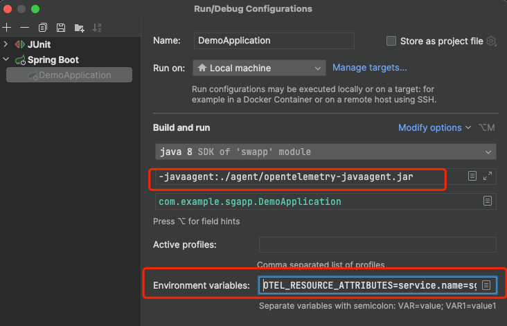

## Signoz Java Application Demo

This is a demo project for Signoz Java agent, which shows how to use Signoz Java agent in a Java application.

## Pre-install

### 1. Install Opentelemetry Java agent

Download Opentelemetry Java agent:

```shell
# get opentelemetry Java agent
mkdir agent
wget -O ./agent/opentelemetry-javaagent.jar https://github.com/open-telemetry/opentelemetry-java-instrumentation/releases/latest/download/opentelemetry-javaagent.jar
```

### 2. Setup environment variables for Opentelemetry Java agent config

```shell
# Set service name
export OTEL_RESOURCE_ATTRIBUTES=service.name=sgapp

# Set Signoz server address
export OTEL_EXPORTER_OTLP_ENDPOINT=http://localhost:4317
```

### 3. Update Signoz Java agent JVM options

Add `-javaagent` option to your Java application.



## How to run

### 1. Build the demo project

```shell
mvn clean package
```

### 2. Run the demo project

```shell
# Set service name
export OTEL_RESOURCE_ATTRIBUTES=service.name=sgapp
# Set Signoz server address
export OTEL_EXPORTER_OTLP_ENDPOINT=http://localhost:4317

java \
-javaagent:./agent/opentelemetry-javaagent.jar \
-jar target/sgapp-0.0.1-SNAPSHOT.jar
```

## License

[Apache 2.0 License.](/LICENSE)